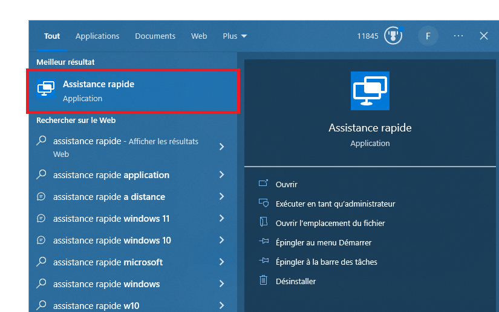

---
output:
  pdf_document: default
  html_document: default
---
# Assistance Rapide

## Présentation

**Qu'est-ce que l'Assistance rapide ?**  
L'Assistance rapide est un logiciel permettant à un Assistant de se connecter à distante à votre ordinateur afin de vous aider à résoudre un problème sur votre ordinateur.

## Utilisation

1. Sélectionnez le bouton Démarrer, entrez Assistance rapide, puis sélectionnez-le dans la liste des résultats.  
    Vous devriez voir l'un ou l'autre :  
      
    

    S'il n'est pas présent, [téléchargez-le ici](https://www.microsoft.com/store/productId/9P7BP5VNWKX5) : Assistance rapide par Microsoft Corporation. dans le `Microsoft Store`.

2. Acceptez la politique de confidentialité, si vous y êtes invité.

3. Dans la zone Code de sécurité de l’Assistant, entrez le code donné par l'Assistant (6 caractères).
    

4. Attendez que vos appareils se connectent.  
    

5. Vérifiez que la personne qui tente de vous aider est celle que vous attendez, puis acceptez la demande.  
    

6. Une fois accepté, une barre en haut affiche que le `Partage d'écran est activé`.  
    

7. L'Assistant va ensuite demander le contrôle, il faut l'accepter depuis la barre.  
    
    

8. À la fin, il suffit de cliquer sur quitter pour terminer avec l'Assistant.  
   L'absence de rectangle jaune et de la barre en haut indique bien que l'Assistant n'a plus accès à votre ordinateur.
