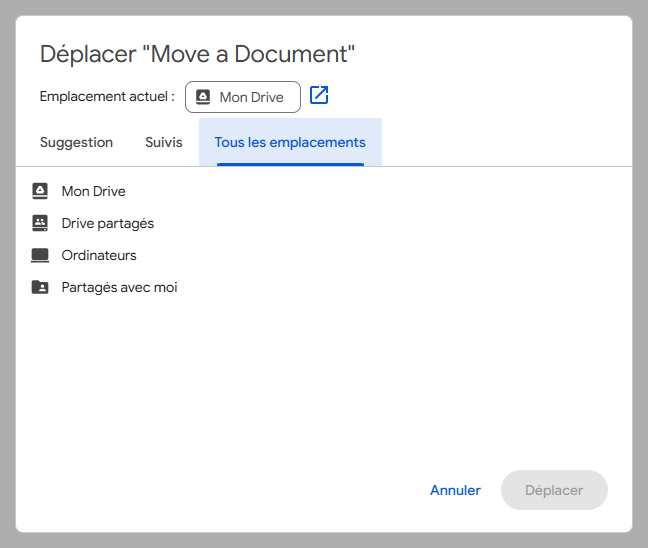

# Google Docs Editors

## Utiliser Markdown

Fonctionne sur : Google Docs, Slides et Drawings

Source : [Utiliser Markdown dans Google Docs, Slides et Drawings](https://support.google.com/docs/answer/12014036?hl=fr)

- `Outils` > `Préférences`
- Cochez `Activer Markdown`

## Ouvrir le dossier contenant le document ouvert

Fonctionne sur : toute la suite Google Docs Editors

- Cliquez sur l'icône `Déplacer` 

- Dans le panneau cliquez sur `Ouvrir dans un nouvel onglet`  à coté de `Emplacement actuel`
  - Cela ouvre un nouvel onglet affichant le dossier contenant le document
- Cliquez sur `Annuler` pour ne pas déplacer le document

## Spécifique à chaque éditeur

### Google Slides

#### Ne pas changer de diapositive lors du défilement

- `Outils` > `Préférences`
- Cochez `Ne pas changer de diapositive lors du défilement`
